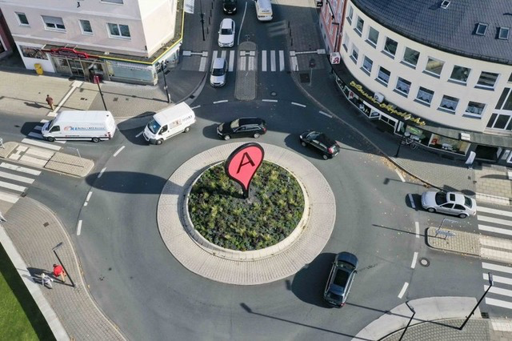

# SS25 Sabotage

## Week 2 - April 29th

Thanks for a great kick-off to all,
For next week, a short summary of what you need to remember:
- please properly start your research. I encourage especially those of you who have not yet engaged at least with the provided material to spend some serious time doing so.
  - present next week in our first 1on1 session the following (in that order):
    - A direction for your project (can be revised until the end of the research phase)
    - A collection of insights that you provide starting points for your project (3-5 observations)
    - Prepare this adequately (visuals, artefacts, sketches, mindmaps, slides) and engage with the material deeply to get the most out of the feedback Lukas and I can provide to help you.
    - If you want to engage in a specific learning endeavour which requires specific attention and potentially our guidance, prepare please:
      - what you want to learn
      - the scope and goal
      - your motivation
  - We are holding another eight research presentations. Please coordinate among your peers who will present and make sure to avoid overlaps!
  - Go through the program of the mini excursion (see last weeks update) and pick what parts of the program you would like to attend.

That's it for now. We will update the schedule later, but you can expect us to start with input and presentations at 10 on monday and tuesday, and the 1on1 sessions in the afternoon.

## Week 1 - April 14th

Hey everybody,
it was great meeting you all and we're excited to start working together on your projects in the upcoming months.
we hope you had a nice easter weekend. In this repository, we will give regular updates on the class, as well as weekly assignments and a short summary. Those you can find in the weeks folder, together with the slides and sometimes some reading material and references.  
---  
### Research Phase Presentations  
  
This week we kicked off the project and gave a spotty overview of the potential contextual background for the class.  
The next weeks will be about determining a general theme for your project and developing your project hypothesis and statement.  
To jumpstart the research, we will distribute uncovering potential project directions. The following topics should be considered starting points and introduce various interpretations:  
  
- **semantics of sabotage**
  What are the delineations of sabotage, obfuscation, vandalism, subversion and other terminology?
  
- **sabotage at work**
  Sabotage has it's origin at work and has taken many forms. How did workplace sabotage develop from throwing shoes in machines to quiet quitting? How did it's character and motivation change?

- **bureaucracy and sludge**
  Bureaucracy can take forms that feel like sabotage, while it's inherent nature is to provide latency and friction to prevent sabotage.
  
- **self-sabotage**
  From deep psychology to peer pressure and procrastinating - acting against our immediate or long-term best interest is a part of our life and takes many forms and names.

- **epistemic/ideologic sabotage**  
    Sabotage targeting the discursive mechanisms of belief and truth.  
  
- **sabotage and hybrid warfare**
  sabotage and hybrid warfare has caught our attention in the last years, but not only does it seem to increase, but also the underlying economics have developed.

- **digital systems**
  how do digital systems invite and prevent sabotage? A multitude of digital systems invites further examination. 
  
- **collaboration**
  Any collaborative setting or network is based on mutual trust, and hereby is vulnerable to sabotage. What are the basics mechanics to sanction and prevent sabotage in collaborative settings?
  
- **design and activism**
  From critical design to activist art and design, the creative arts have a rich history in reflecting, participating and enabling discourse and rebellion.
  
- **Sabotage and the public**
  Public spaces often provide the stage for specific acts of sabotage, from blocking streets and railroads to hostile architecture and other subtly excluding designs, which have been often met with sabotage and outrage.
  
  
#### Interesting for most topics, sometimes not closely related to sabotage:

[Unintended Consequences Blog - Bezmenovs Steps](https://unintendedconsequenc.es/bezmenovs-steps/)  

[Mackenthun, Dosch - Subversive Semantics in Political and Cultural Discourse
](https://library.oapen.org/handle/20.500.12657/76603) 

[Goldstein - Psychology of Vandalism](https://books.google.de/books?hl=en&lr=&id=ByfLBgAAQBAJ&oi=fnd&pg=PA1908&dq=vandalism&ots=H7qETs67th&sig=5NEJXh4ztWbnx48oKjKXLry68sI&redir_esc=y#v=onepage&q=vandalism&f=false)

[Allen - An Aesthetic Theory of Vandalism](https://journals.sagepub.com/doi/abs/10.1177/001112877802400305)

[Marina Benjamin - Me vs Myself](https://aeon.co/essays/why-do-i-let-myself-sabotage-my-own-best-laid-plans) 

[mars - workplace sabotage](https://www.taylorfrancis.com/books/edit/10.4324/9781315203850/work-place-sabotage-gerald-mars?context=ubx)

[Donovan - New generation of cyberwarfare](https://www.theatlantic.com/technology/archive/2024/09/new-generation-cyberwarfare/679870/)

[Mumford - Hybrid Warfare: The continuation of ambiguity by other means](https://www.cambridge.org/core/journals/european-journal-of-international-security/article/hybrid-warfare-the-continuation-of-ambiguity-by-other-means/1B3336D8109D418F89D732EB98B774E5)

[Richterova et al. Russian Sabotage in the Gig-Economy Era](https://www.tandfonline.com/doi/full/10.1080/03071847.2024.2401232#d1e295)

[Verschure -  The Nature and Dynamics of Collaboration](https://direct.mit.edu/books/oa-edited-volume/5895/The-Nature-and-Dynamics-of-Collaboration) (Open Access Book)

[Galdon - Counterism & trust: From critical to tactical design](https://researchonline.rca.ac.uk/5908/1/DRS2024%20-%20From%20Critical%20to%20Tactical%20Design.pdf)

[Chellew - Defending Suburbia](https://cjur.uwinnipeg.ca/index.php/cjur/article/view/164)
  [D'Orca -  The Arsenal of Exclusion & Inclusion](https://www.gsd.harvard.edu/project/the-arsenal-of-exclusion-inclusion/)

[Brehm, Gates - Working, Shirking, and Sabotage: Bureaucratic Response to a Democratic Public ](https://books.google.de/books?hl=en&lr=&id=lEg_DwAAQBAJ&oi=fnd&pg=PR7&dq=sabotage+bureaucracy&ots=dkeKckR7I_&sig=6WRfookQbmkPfJ93DvNCu_dNIn8&redir_esc=y#v=onepage&q=sabotage%20bureaucracy&f=false)

  [The CIA's Simple Sabotage Field Manual](https://www.cia.gov/static/5c875f3ec660e092cf893f60b4a288df/SimpleSabotage.pdf)

[Lovinck - Stuck on the Platform](https://valiz.nl/en/publications/stuck-on-the-platform)

[Pape - The Aesthetics of Stealth: Digital Culture, Video Games, and the Politics of Perception](https://direct.mit.edu/books/oa-monograph/5847/The-Aesthetics-of-StealthDigital-Culture-Video)

[Kudina, Verbeek - Ethics from Within: Google Glass, the Collingridge Dilemma, and the Mediated Value of Privacy
](https://journals.sagepub.com/doi/full/10.1177/0162243918793711)  
  
[Verbeek - Moralizing Technology](https://press.uchicago.edu/ucp/books/book/chicago/M/bo11309162.html)

[Verbeek - What things do](https://www.psupress.org/books/titles/0-271-02539-5.html)

[The Utopia of Rules: On Technology, Stupidity, and the Secret Joys of Bureaucracy" by David Graeber (2015)](https://files.libcom.org/files/David_Graeber-The_Utopia_of_Rules_On_Technology_St.pdf#page=6.06)

[Obfuscation](https://direct.mit.edu/books/book/3112/ObfuscationA-User-s-Guide-for-Privacy-and-Protest) *a bit dated but still ok*

[Holt - Cloud Policy: A History of Regulating Pipelines, Platforms, and Data](https://direct.mit.edu/books/oa-monograph/5830/Cloud-PolicyA-History-of-Regulating-Pipelines)

[Tharp - Discursive Design](https://direct.mit.edu/books/book/4163/Discursive-DesignCritical-Speculative-and)

#### Niche resources
Education [Bell Hooks - Teaching to Transgress](https://www.routledge.com/Teaching-to-Transgress-Education-as-the-Practice-of-Freedom/hooks/p/book/9780415908085)
  
Videos:  
[Benjamin Bratton: The Stack: Design and Geopolitics in the Age of Planetary-Scale Computing](https://www.youtube.com/watch?v=IXan6TvMqgk)

[YouTube Channel Trust](https://www.youtube.com/@trust_support)

### Research presentations (TASK INCLUDED - READ THOROUGHLY)

The first task is to do a deep research into one of these topics and present it to the class in a 10 - 15 minute presentation. Remember, that the general basics shouldn't be covered in every presentation and the purpose of this exerise is depth! Also, the literature above are only starting points, so your presentation is expected to go beyond those.
Focus on finding interesting sabotage related phenomena, that offer entry points for the design project related research.
This is the schedule for the presentations:  
  
### **Monday April 28th before lunch:**  
### Philipp, Freddy, Mona, Dachi  
### **Monday April 28th after lunch:**  
### Miriam (H.), Leon, Max, Linus

### Task summary:
- Pick one of the topics above or come up with your own
- prepare a 10-15 minute presentation with focus on depth, no general introductions to avoid overlap
- others are due the week after :-) If for some reasons you can't attend or don't have the time to prepare, please find a substitute on your own.

*Feel free to come up with another sabotage-related topic, if you had something else in mind.*

**Important:** Coordinate so that the topics are evenly distributed and there is not a lot of overlap. Multiple presentations on one topic are welcome, as long as they favor different aspects.  
Also of note: The topic should reflect your interest, but shouldn't necessarily determine your project direction yet.
Collect all your references to make them accessible to everyone after the presentations. 
---
### GitHub peer learning  
  
You can all publish on this repository. To accomplish this you can either watch a tutorial on how to do it (I recommend using Visual Study Code as an editor) or ask one of your class mates to show you. It's fairly simple once you get the gist and a seamless way to keep a journal and share insights.  
---
### Mini Excursion  
  
We are planning to visit the event [**Digital Interventions. Bodies, Infrastructures, Politics**](https://www.sfb-intervenierende-kuenste.de/veranstaltungen/jahrestagung2025.html) at HAU on the 9th and 10th of May. 
  
We will announce it again in class, but please check your availability.  
--- 
### Day two consultations  
We will start with small group discussions in which you can already start mapping out the space you want to further research. Individually prepare your current research for us to feedback for Tuesday afternoon from two with a couple of slides (roughly put together inspiration, themes and sketches on slides that can be presented on a laptop (only headlines and images)).  
---
### Preliminary schedule

**Monday April 28th**  
10 - 11 Group assignments
11 - 13 Research presentations with breaks - please be on time.  
13 - 14 Break  
14 - 16 Research Presentations with breaks - please return on time.  

  
  
**Tuesday April 28th**  
10 - 11 Input (either coding or theory)  
11 - 13 Working  
from 14 Working & Consultations  

